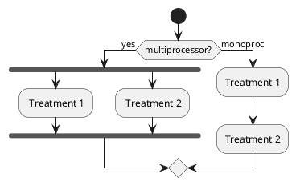
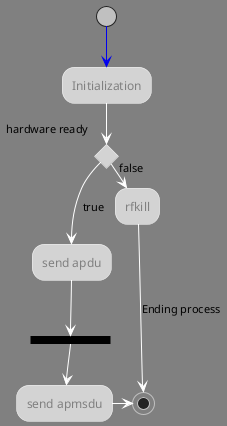
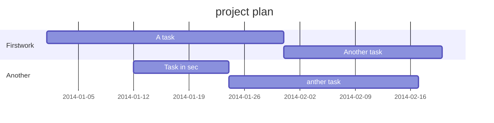
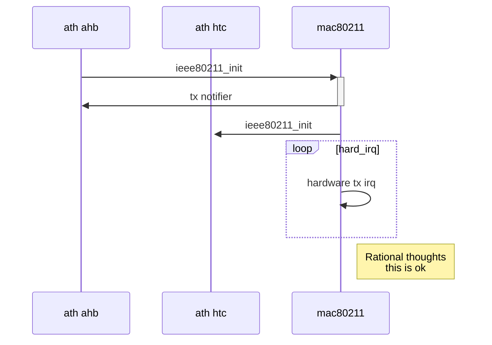
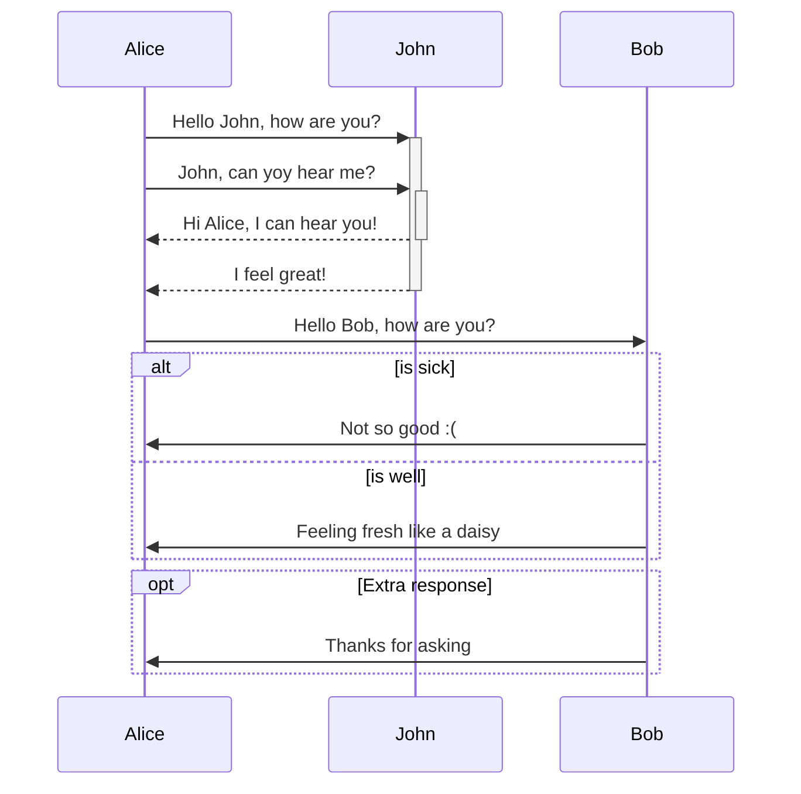

### Linux wireless driver:ath9k

Tags: 802.11 mac802


***

QCA9331
:    qualcomm atheros 1*1 802.11n WiSoC

QCA9341
:    qualcomm atheros 2*2 300Mbps 802.11n *WiSoC*

>please reserved this document,refer [openwr][openwrturl] 或者使用快捷键 `Ctrl+Shift+M`。
> by &copy; lawrence rao
**Content**

<!-- toc -->

- [Linux wireless driver:ath9k](#linux-wireless-driverath9k)
- [Todo list](#todo-list)
- [mathJax](#mathjaxlatex)
- [highlight source by setting language](#highlight-source-by-setting-language)
- [charts UML Sequence](#charts-uml-sequencehttpsgithubcomknsvmermaid)
- [linux atheros ath9k driver 序列图](#linux-atheros-ath9k-drivermac80211-序列图)
- [waved timing(hw)](#waved-timinghw)
- [Table](#table)

<!-- tocstop -->
**Markdown Enhanced for atom editor** ：
> - linux network framework net/dev/core
> - `linux mac80211 framework`
> - `netlink nl80211/cfg80211 interface`
> - `ath9k ahb in SoC driver`
> - `iw config`
> - `hostapd processing`

>
***

### Todo list
- [ ] only list item
- [ ] 支持以 PDF 格式导出文稿
- [ ] 改进 Cmd 渲染算法，使用局部渲染技术提高渲染效率
- [ ] 新增 Todo 列表功能

### mathJax[^LaTeX]

$$E=mc^2$$

### highlight source by setting language

```cpp
#include <stdio.h>
int main(int argc,char **argv){
  return 0;
}
```


### charts [UML Sequence](https://github.com/knsv/mermaid)

[Plant UML](http://www.plantuml.com "plant UML")

```plantuml
@startuml

skinparam roundcorner 20
skinparam maxmessagesize 60
'skinparam handwritten true
skinparam backgroundColor #EEEBDC
skinparam sequence {
    ArrowThickness 1
    ArrowFontColor gray
    ArrowColor black
    'ActorBorderColor DeepSkyBlue
    LifeLineBorderColor blue
    LifeLineBackgroundColor #A9DCDF
    'Participant underline
    ParticipantBorderColor lightGray
    ParticipantBackgroundColor DodgerBlue
    ParticipantFontName Impact
    ParticipantFontSize 17
    ParticipantFontColor #A9DCDF
    ActorBackgroundColor aqua
    ActorFontColor DeepSkyBlue
    ActorFontSize 17
    ActorFontName Aapex
}
Alice -> Bob: Authentication Request
Bob --> Alice: Authentication Response

Alice -> Bob: Another authentication Request
Alice <-- Bob: another authentication Response

@enduml
```

```plantuml
@startuml

'skinparam classAttributeIconSize 0
'skinparam backgroundColor #808080
'skinparam classAttributeFontColor grey
'skinparam stereotypeCBackgroundColor YellowGreen
skinparam class {
''  BackgroundColor lightgrey
''  ArrowColor  lightgrey
''  AttributeFontColor black
''  AttributeFontStyle bold
''  AttributeFontName Courier
''  AttributeFontSize 13
''  FontColor grey
''  BorderColor lightblue  
}
'skinparam monochrome true
class Wiphy{
  +name;
  '..
  char priv[0];
  '--
  {abstract} +register();
  {abstract} +Wiphy_new();
}
'class ieee80211_local << (S,#FF7700) >>{
class ieee80211_local {
  name;
}
Wiphy <|-- ieee80211_local
Wiphy *-- Class04
'Class05 o-- Class06
'Class07 .. Class08
'Class09 -- Class10

@enduml
```









---



### linux atheros ath9k driver[^mac80211] [序列图]()


---


### waved timing(hw)
```wavedrom
{signal: [
  {name: '时钟clk', wave: 'p.....|...'},
  {name: 'data', wave: 'x.345x|=.x', data: ['head', 'body', 'tail', 'data']},
  {name: 'req', wave: '010...|1.0'},
  {},
  {name: 'ack', wave: '1.....|01.'}

]}
```

### [Table]()

| 项目        | 价格   |  数量  |
| --------   | -----:  | :----:  |
| 计算机     | \$1600 |   5     |
| 手机        |   \$12   |   12   |
| 管线        |    \$1    |  234  |


<i class="icon-pencil"></i> editor mode


[^LaTeX]: 支持 **LaTeX** 编辑显示支持，例如：$\sum_{i=1}^n a_i=0$， 访问 [MathJax][4] 参考更多使用方法。
[^mac80211]: linux driver layer

[openwrturl]: http://www.openwrt.org
