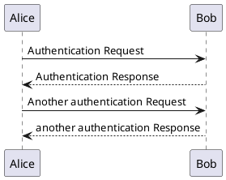
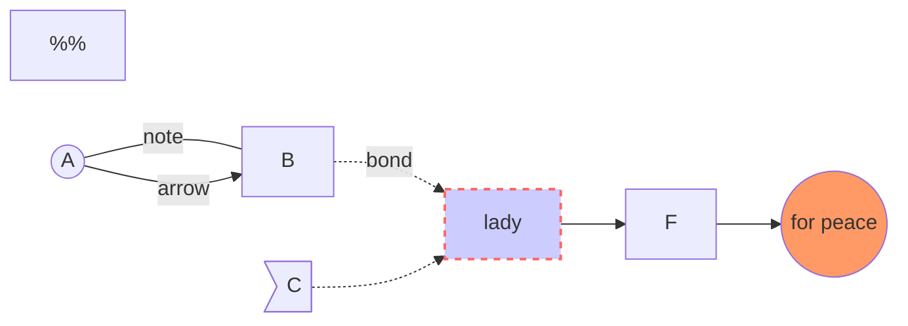
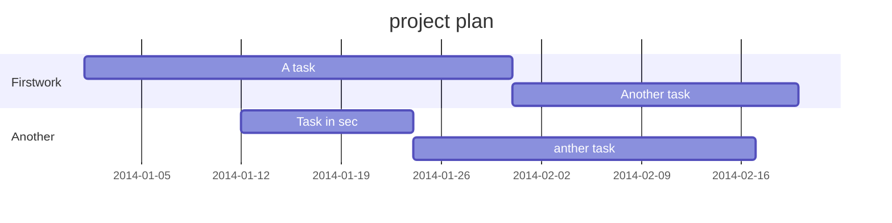
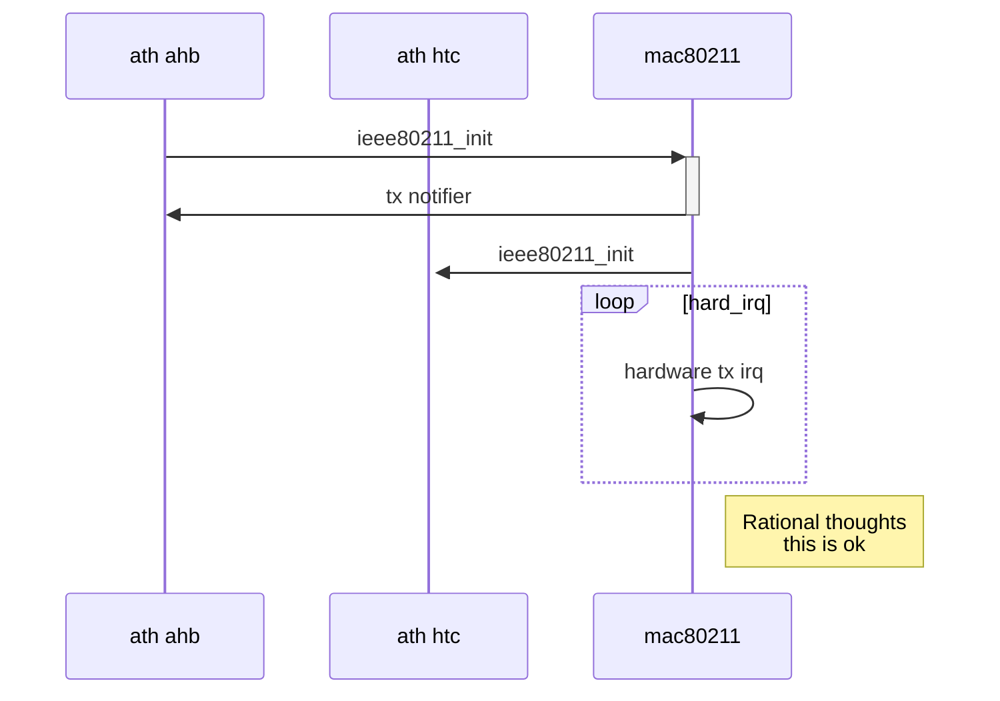
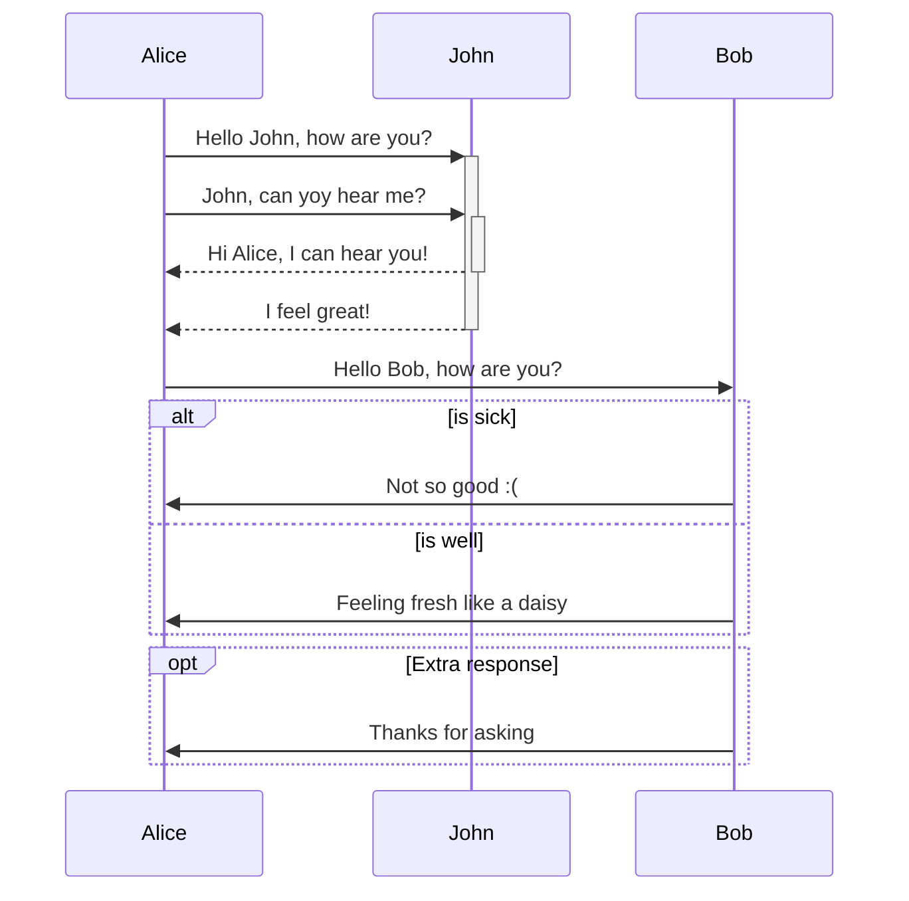

# 欢迎使用 Cmd Markdown 编辑阅读器

------

我们理解您需要更便捷更高效的工具记录思想，整理笔记、知识，并将其中承载的价值传播给他人，**Cmd Markdown** 是我们给出的答案 —— 我们为记录思想和分享知识提供更专业的工具。 您可以使用 Cmd Markdown：

> * 整理知识，学习笔记
> * 发布日记，杂文，所见所想
> * 撰写发布技术文稿（代码支持）
> * 撰写发布学术论文（LaTeX 公式支持）


除了您现在看到的这个 Cmd Markdown 在线版本，您还可以前往以下网址下载：

### [Windows/Mac/Linux 全平台客户端](https://www.zybuluo.com/cmd/)

> 请保留此份 Cmd Markdown 的欢迎稿兼使用说明，如需撰写新稿件，点击顶部工具栏右侧的 <i class="icon-file"></i> **新文稿** 或者使用快捷键 `Ctrl+Alt+N`。

------

## 什么是 Markdown

Markdown 是一种方便记忆、书写的纯文本标记语言，用户可以使用这些标记符号以最小的输入代价生成极富表现力的文档：譬如您正在阅读的这份文档。它使用简单的符号标记不同的标题，分割不同的段落，**粗体** 或者 *斜体* 某些文字，更棒的是，它还可以

### 1. 制作一份待办事宜 [Todo 列表](https://www.zybuluo.com/mdeditor?url=https://www.zybuluo.com/static/editor/md-help.markdown#13-待办事宜-todo-列表)

- [ ] 支持以 PDF 格式导出文稿
- [ ] 改进 Cmd 渲染算法，使用局部渲染技术提高渲染效率
- [x] 新增 Todo 列表功能
- [x] 修复 LaTex 公式渲染问题
- [x] 新增 LaTex 公式编号功能

### 2. 书写一个质能守恒公式[^LaTeX]

$$E=mc^2$$

### 3. 高亮一段代码[^code]

```python
@requires_authorization
class SomeClass:
    pass

if __name__ == '__main__':
    # A comment
    print 'hello world'
```

### 4. 高效绘制 [流程图](https://github.com/knsv/mermaid)



---



### 5. 高效绘制 [序列图](https://github.com/knsv/mermaid)


---


### waved timing(hw)
```wavedrom
{signal: [
  {name: '时钟clk', wave: 'p.....|...'},
  {name: 'data', wave: 'x.345x|=.x', data: ['head', 'body', 'tail', 'data']},
  {name: 'req', wave: '010...|1.0'},
  {},
  {name: 'ack', wave: '1.....|01.'}
]}
```

### 6. 绘制表格

| 项目        | 价格   |  数量  |
| --------   | -----:  | :----:  |
| 计算机     | \$1600 |   5     |
| 手机        |   \$12   |   12   |
| 管线        |    \$1    |  234  |

### 7. 更详细语法说明

想要查看更详细的语法说明，可以参考我们准备的 [Cmd Markdown 简明语法手册][1]，进阶用户可以参考 [Cmd Markdown 高阶语法手册][2] 了解更多高级功能。

总而言之，不同于其它 *所见即所得* 的编辑器：你只需使用键盘专注于书写文本内容，就可以生成印刷级的排版格式，省却在键盘和工具栏之间来回切换，调整内容和格式的麻烦。**Markdown 在流畅的书写和印刷级的阅读体验之间找到了平衡。** 目前它已经成为世界上最大的技术分享网站 GitHub 和 技术问答网站 StackOverFlow 的御用书写格式。


<i class="icon-pencil"></i> 模式：切换 普通/Vim/Emacs 编辑模式


<i class="icon-fullscreen"></i> 全屏：简洁，简洁，再简洁，一个完全沉浸式的写作和阅读环境


作者 [@ghosert][3]
2015 年 06月 15日

[^LaTeX]: 支持 **LaTeX** 编辑显示支持，例如：$\sum_{i=1}^n a_i=0$， 访问 [MathJax][4] 参考更多使用方法。

[^code]: 代码高亮功能支持包括 Java, Python, JavaScript 在内的，**四十一**种主流编程语言。

[1]: https://www.zybuluo.com/mdeditor?url=https://www.zybuluo.com/static/editor/md-help.markdown
[2]: https://www.zybuluo.com/mdeditor?url=https://www.zybuluo.com/static/editor/md-help.markdown#cmd-markdown-高阶语法手册
[3]: http://weibo.com/ghosert
[4]: http://meta.math.stackexchange.com/questions/5020/mathjax-basic-tutorial-and-quick-reference
