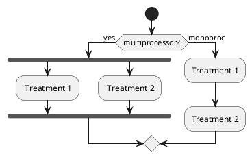
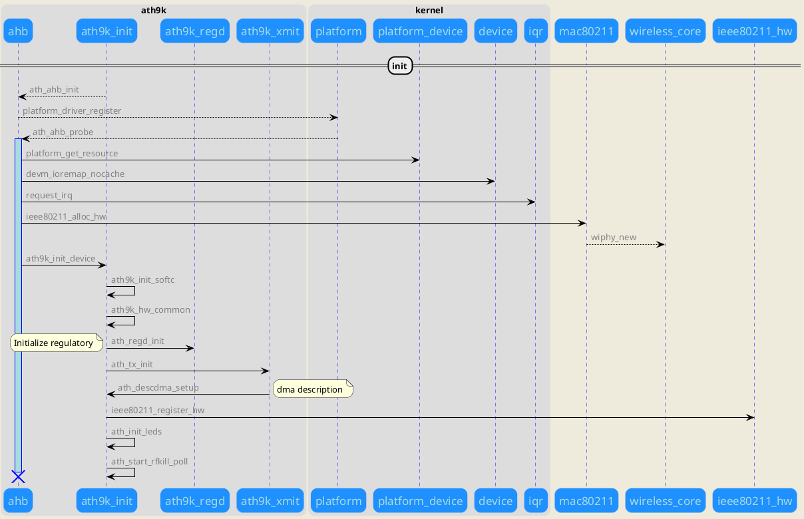
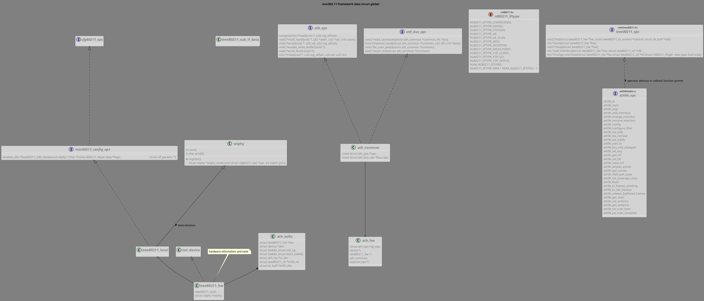
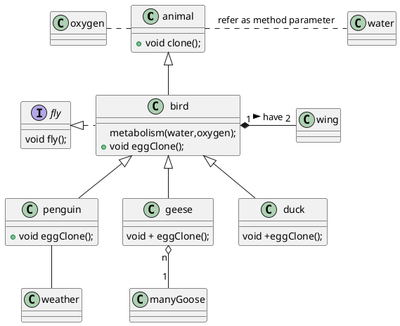
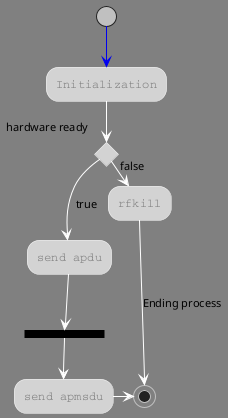
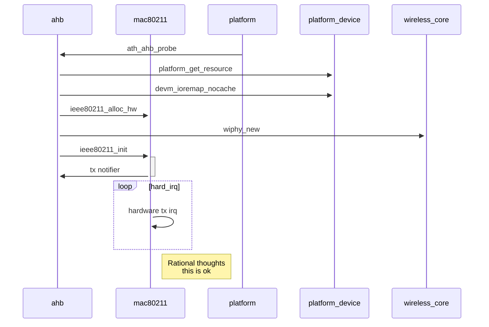
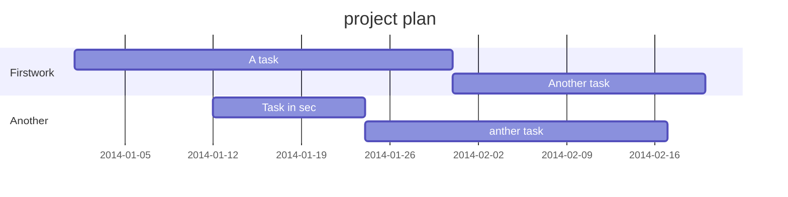

<details> 
<summary></summary>
r_ath9k_class

@startuml;

Class01 "1" *-- "many" Class02 : contains;
Class03 o-- Class04 : aggregation;
Class05 --> "1" Class06;

'skinparam classAttributeIconSize 0
skinparam backgroundColor #808080;
'skinparam classAttributeFontColor grey
'skinparam stereotypeCBackgroundColor YellowGreen
skinparam class {;
''  BackgroundColor lightgrey
''  ArrowColor  lightgrey
  AttributeFontColor grey;
''  AttributeFontStyle bold
'Consolas,"Liberation Mono",Menlo,Courier,monospace
'Helvetica,"Hiragino Sans GB","微软雅黑","Microsoft YaHei UI",SimSun,SimHei,arial,sans-serif'
  AttributeFontName  monospace;
''  AttributeFontSize 13
    FontStyle Bold;
    FontName "Nimbus Sans L";
    FontSize  17;
  ''  FontColor grey
    BackgroundColor lightGray    ;
    BorderColor #f0f0f0;
    BorderThickness 1  ;

};
title <b>mac802.11</b> framework data struct global;
'skinparam monochrome true
interface cfg80211_ops{;

};
interface mac80211_config_ops{;
  wireless_dev *ieee80211_add_iface(struct wiphy *,char *name,nl80211_iftype type,*flags,					struct vif_params *);
};
class wiphy{;
  +name;
  '..
  +char priv[0];
  '--
  +register();
struct wiphy *wiphy_new(const struct cfg80211_ops *ops, int sizeof_priv);
};
class ieee80211_sub_if_data{;

};
'class ieee80211_local << (S,#FF7700) >>{
class ieee80211_local {;
  'name;
};


class net_device{;

};
class ieee80211_hw{;
  ieee80211_conf;
  struct wiphy *wiphy;
};
note top of ieee80211_hw:hardware information and state;
interface ath_ops{;
  unsigned int (*read)(void *, u32 reg_offset);
  void (*multi_read)(void *, u32 *addr, u32 *val, u16 count);
  void (*write)(void *, u32 val, u32 reg_offset);
  void (*enable_write_buffer)(void *);
  void (*write_flush) (void *);
  u32 (*rmw)(void *, u32 reg_offset, u32 set, u32 clr);
};
interface ath_bus_ops{;
  void (*read_cachesize)(struct ath_common *common, int *csz);
  bool (*eeprom_read)(struct ath_common *common, u32 off, u16 *data);
  void (*bt_coex_prep)(struct ath_common *common);
  void (*aspm_init)(struct ath_common *common);
};
class ath_common{;
  const struct ath_ops *ops;
  const struct ath_bus_ops *bus_ops;
};
class ath_hw{;
  struct ath_ops reg_ops;
  device *;
  ieee80211_hw *;
  ath_common;
  eeprom_ops *;
};

cfg80211_ops <|.. mac80211_config_ops ;
mac80211_config_ops <|.. ieee80211_local ;

@enduml
r_ath9k_class
</details>


<details> 
<summary></summary>
rao_ath9k
@startuml

skinparam roundcorner 20;
skinparam maxmessagesize 60;
'skinparam handwritten true;
skinparam backgroundColor #EEEBDC;
skinparam sequence {;
    ArrowThickness 1;
    ArrowFontColor gray;
    ArrowColor black;
    'ActorBorderColor DeepSkyBlue;
    LifeLineBorderColor blue;
    LifeLineBackgroundColor #A9DCDF;
    'Participant underline
    ParticipantBorderColor lightGray;
    ParticipantBackgroundColor DodgerBlue;
    'ParticipantFontName Impact;
    ParticipantFontSize 17;
    ParticipantFontColor #A9DCDF;
    ActorBackgroundColor aqua;
    ActorFontColor DeepSkyBlue;
    ActorFontSize 17;
    ActorFontName Aapex;
    'BoxBackgroundColor white
    BoxBorderCOlor #EEEBDC;
}
==init==
box "ath9k";
  Participant ahb;
  Participant ath9k_init;
  Participant ath9k_regd;
  Participant ath9k_xmit;

endbox  ;
'#white'
box "kernel";
  Participant platform;
  Participant platform_device;
  Participant device;
  Participant iqr  ;
endbox  ;


ath9k_init-->ahb:ath_ahb_init;
ahb-->platform:platform_driver_register;
platform-->ahb:ath_ahb_probe;
activate ahb;
ahb->platform_device: platform_get_resource;
ahb->device: devm_ioremap_nocache;
ahb->iqr:request_irq;
ahb->mac80211:ieee80211_alloc_hw;
mac80211-->wireless_core:wiphy_new;
ahb->ath9k_init:ath9k_init_device;
ath9k_init->ath9k_init:ath9k_init_softc;
ath9k_init->ath9k_init:ath9k_hw_common;
ath9k_init->ath9k_regd:ath_regd_init;
  note left:Initialize regulatory;
ath9k_init->ath9k_xmit:ath_tx_init;
ath9k_init<-ath9k_xmit:ath_descdma_setup;
  note right: dma description;
ath9k_init->ieee80211_hw:ieee80211_register_hw;
ath9k_init->ath9k_init:ath_init_leds;
ath9k_init->ath9k_init:ath_start_rfkill_poll;
destroy ahb;
@enduml
rao_ath9k
</details>


### Linux wireless driver:ath9k

Tags: 802.11 mac802


***

QCA9331
:    qualcomm atheros 1*1 802.11n WiSoC

QCA9341
:    qualcomm atheros 2*2 300Mbps 802.11n *WiSoC*

>please reserved this document,refer [openwr][openwrturl] 或者使用快捷键 `Ctrl+Shift+M`。
> by &copy; lawrence rao
**Content**

<!-- toc -->

- [Linux wireless driver:ath9k](#linux-wireless-driverath9k)
- [Todo list](#todo-list)
- [mathJax](#mathjaxlatex)
- [highlight source by setting language](#highlight-source-by-setting-language)
- [charts UML Sequence](#charts-uml-sequencehttpsgithubcomknsvmermaid)
- [linux atheros ath9k driver 序列图](#linux-atheros-ath9k-drivermac80211-序列图)
- [waved timing(hw)](#waved-timinghw)
- [Table](#table)

<!-- tocstop -->
**Markdown Enhanced for atom editor** ：
> - linux network framework net/dev/core
> - `linux mac80211 framework`
> - `netlink nl80211/cfg80211 interface`
> - `ath9k ahb in SoC driver`
> - `iw config`
> - `hostapd processing`

>
***

### Todo list
- [ ] only list item
- [ ] 支持以 PDF 格式导出文稿
- [ ] 改进 Cmd 渲染算法，使用局部渲染技术提高渲染效率
- [ ] 新增 Todo 列表功能

### mathJax[^LaTeX]

$$E=mc^2$$

### highlight source by setting language

```cpp
#include <stdio.h>
int main(int argc,char **argv){
  return 0;
}
```


### charts [UML Sequence](https://github.com/knsv/mermaid)

[Plant UML](http://www.plantuml.com "plant UML")





---






---


### linux atheros ath9k driver[^mac80211] [序列图]()





---

### waved timing(hw)
```wavedrom
{signal: [
  {name: '时钟clk', wave: 'p.....|...'},
  {name: 'data', wave: 'x.345x|=.x', data: ['head', 'body', 'tail', 'data']},
  {name: 'req', wave: '010...|1.0'},
  {},
  {name: 'ack', wave: '1.....|01.'}

]}
```

### [Table]()

| 项目        | 价格   |  数量  |
| --------   | -----:  | :----:  |
| 计算机     | \$1600 |   5     |
| 手机        |   \$12   |   12   |
| 管线        |    \$1    |  234  |


<i class="icon-pencil"></i> editor mode


[^LaTeX]: 支持 **LaTeX** 编辑显示支持，例如：$\sum_{i=1}^n a_i=0$， 访问 [MathJax][4] 参考更多使用方法。
[^mac80211]: linux driver layer

[openwrturl]: http://www.openwrt.org
